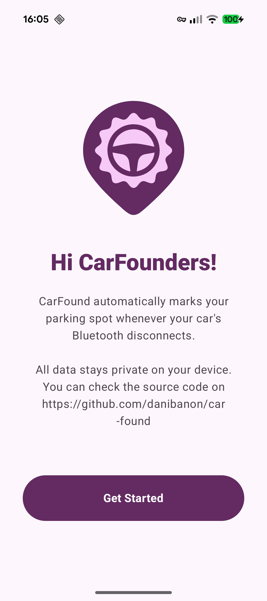
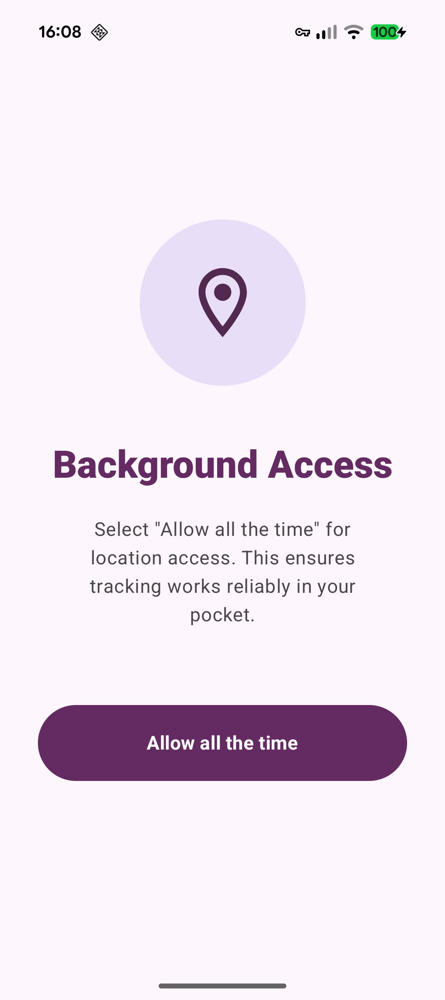

#  CarFound

CarFound is an Android application designed to help you track your car's parking location automatically. By monitoring Bluetooth disconnections from your car's hands-free system, the app captures your GPS coordinates the moment you park.

## Features

- **Automatic Tracking**: Detects when you disconnect from your car's Bluetooth and saves the location.
- **Location History**: View a list of your previous parking spots with timestamps.
- **Map View**: Visualize your car's last known location on an interactive map (powered by OpenStreetMap).
- **Notifications**: Get a notification with the address whenever a parking event is detected.
- **Battery Efficient**: Uses passive listening and location triggers to minimize battery drain.

## Tech Stack

- **Language**: Kotlin
- **UI Framework**: Jetpack Compose
- **Concurrency**: Kotlin Coroutines & Flow
- **Location Services**: Google Play Services Location API
- **Maps**: osmdroid
- **Architecture**: MVVM with Repository pattern

## Showcase

<p align="center">
  
  
  
</p>

## Getting Started

1. Clone the repository.
2. Open the project in Android Studio.
3. Build and run the app on your Android device (minSdk 26).
4. Grant the necessary Bluetooth and Location permissions.

## License

This project is licensed under the MIT License.

## Releasing

To generate a release APK:
1. Go to `Build > Generate Signed Bundle / APK...`
2. Select `APK` and click `Next`.
3. Create or select your keystore.
4. Select `release` build variant.
5. The APK will be generated in `app/release/`.

Alternatively, use the command line:
```bash
./gradlew assembleRelease
```
